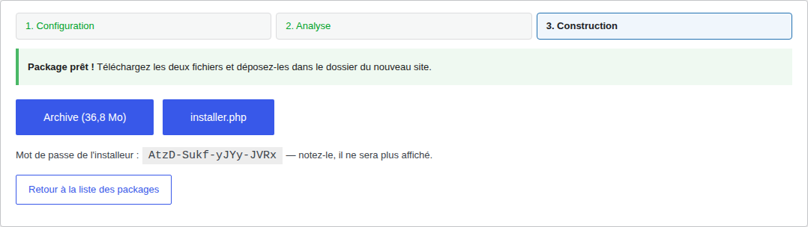
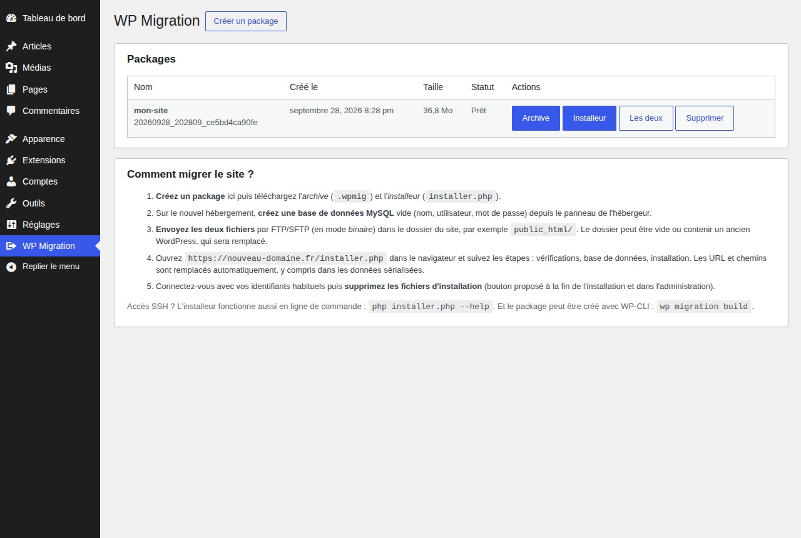

<p align="center"></p>

# WP Migration

Extension WordPress pour **copier un site complet (fichiers + base de données) vers un nouveau domaine et/ou un nouvel hébergement** :

1. sur le site d'origine, l'extension crée un **package** : une archive `.wpmig` + un fichier `installer.php` autonome ;
2. on dépose ces deux fichiers sur le nouveau serveur (dossier vide ou WordPress existant) ;
3. on ouvre `https://nouveau-domaine.fr/installer.php` : l'installeur extrait les fichiers, importe la base, remplace les URL et les chemins partout (y compris dans les données sérialisées), réécrit `wp-config.php` et `.htaccess`.

Et si le site d'origine reste en ligne pendant que vous travaillez sur la copie, la [synchronisation du contenu](#synchroniser-le-contenu-travail-sur-une-copie) y rapatrie ensuite les commandes, clients, produits, articles et pages créés entre-temps.

WordPress n'a **pas** besoin d'être installé sur la destination. S'il l'est déjà (installation « en un clic » de l'hébergeur), l'extension peut aussi **importer le site d'origine directement, sans FTP** : voir [Transfert direct](#transfert-direct-sans-ftp).


## Captures d'écran

### Sur le site d'origine : création du package

| 1. Configuration | 2. Analyse |
|---|---|
|  |  |
| **3. Package prêt** (archive, installeur et mot de passe) | **Liste des packages** |
|  |  |

### Transfert direct de serveur à serveur

| Lien secret sur le site d'origine | Import depuis un WordPress déjà installé |
|---|---|
|  |   |

### Sur le nouveau serveur : installeur

| Mot de passe | Vérifications du serveur |
|---|---|
|  |  |
| **Installation en cours** | **Installation terminée** |
|  |  |

### Synchronisation du contenu (copie de travail)

| Site d'origine : autoriser | Copie de travail : analyse |
|---|---|
|  |  |


### Nettoyage automatique des anciens packages


Après la migration, l'administration du nouveau site confirme l'opération avec le résultat des contrôles et rappelle, le cas échéant, de supprimer les fichiers d'installation restants :


### Rapport de migration

Conservé dans l'administration du nouveau site, même après la suppression des fichiers d'installation :


## Compatibilité

| | Pris en charge | Réellement testé |
|---|---|---|
| WordPress | 4.9 → 7.1 (dernière version) | 4.9.26 sous PHP 5.6, 7.1.2 sous PHP 8.4 |
| PHP | 5.6 → 8.4 | 5.6, 7.4 et 8.4 (+ analyse PHPCompatibility 5.6+) |
| Base de données | MySQL 5.5+ / 8.x, MariaDB 10.x / 11.x (collations et moteurs adaptés automatiquement) | MariaDB 10.11 |
| Serveurs web | Apache, LiteSpeed, nginx, IIS | serveur intégré de PHP |

Non pris en charge : WordPress **multisite** (refusé explicitement plutôt que migré à moitié).

## Installation

Télécharger `wp-migration-x.y.z.zip` depuis la [dernière release](https://github.com/fred-selest/wp-migration/releases/latest), puis **Extensions → Ajouter → Téléverser une extension** et activer. Le menu **WP Migration** apparaît dans l'administration.

### Mises à jour

Depuis la version 1.4.0, WordPress détecte les nouvelles versions publiées sur GitHub comme pour une extension de wordpress.org :

- avis « Une nouvelle version est disponible » dans **Extensions** et **Tableau de bord → Mises à jour**, avec le journal des modifications dans « Afficher les détails » ;
- mise à jour en un clic, avec WP-CLI (`wp plugin update wp-migration`) ou **automatique** (lien « Activer les mises à jour auto ») ;
- lien **Vérifier les mises à jour** sous l'extension pour interroger GitHub immédiatement (sinon, toutes les 12 heures).


L'en-tête `Update URI` empêche WordPress de chercher l'extension sur wordpress.org, où une autre extension (fermée) utilise le même identifiant `wp-migration`. Les exigences de la nouvelle version (WordPress, PHP) sont lues dans son `readme.txt` : une mise à jour incompatible avec le serveur est signalée comme telle. Si l'extension a été installée dans un dossier au nom différent (par exemple `wp-migration-main`), il est conservé lors de la mise à jour.

Pour une installation en 1.3.0 ou antérieure, la mise à jour vers la 1.4.0 se fait une dernière fois manuellement : téléverser le zip et choisir « Remplacer la version installée ».

## Migrer un site

### 1. Créer le package (site d'origine)

**WP Migration → Créer un package**, puis un assistant en 3 étapes :

1. **Configuration** : nom, site complet ou base de données seule, exclusions (dossiers ou fichiers, extensions, médias), données des tables de journaux et de cache à laisser de côté (la table est recréée **vide**, jamais supprimée), filtres (transients, spam, révisions), mot de passe de l'installeur (**généré automatiquement**, à noter).
2. **Analyse** : vérifications du serveur, nombre et taille des fichiers, fichiers volumineux, fichiers illisibles, tables et tailles ; les tables de journaux ou de cache volumineuses sont signalées (jamais `postmeta`, les commandes ou les registres RGPD).
3. **Construction** : export SQL puis archive, avec barre de progression. Téléchargez ensuite l'**archive** et **installer.php**.

En SSH : `wp migration build --dir=/chemin/export` (un mot de passe est généré et affiché ; `--password=…` pour le choisir, voir `wp help migration build`).

### 2. Installer (serveur de destination)

1. Créer une base de données MySQL vide depuis le panneau de l'hébergeur.
2. Envoyer l'archive et `installer.php` par FTP/SFTP **en mode binaire** dans le dossier du site.
3. Ouvrir `https://nouveau-domaine.fr/installer.php` :
   - **Vérifications** : version de PHP compatible avec la version de WordPress, extensions, droits d'écriture, espace disque, intégrité de l'archive ;
   - **Base de données & URL** : identifiants (pré-remplis si un `wp-config.php` existe déjà), préfixe des tables (modifiable), nouvelle URL (détectée automatiquement), options avancées, création facultative d'un compte administrateur ;
   - **Installation** : vérification complète de l'archive (CRC de chaque bloc) **avant toute modification**, puis extraction et import, avec progression et reprise automatique en cas de coupure ;
   - **Terminé** : résumé des contrôles, bouton pour supprimer l'installeur, l'archive et les fichiers temporaires, puis connexion.

En SSH :

```sh
php installer.php --url=https://nouveau-domaine.fr --db-name=base --db-user=utilisateur --db-pass=secret --cleanup
php installer.php --help
```

### Transfert direct (sans FTP)

L'archive peut aller **directement du site d'origine au nouveau serveur**, sans passer par votre ordinateur ni par le FTP. Sur le site d'origine, **WP Migration → Packages → Transfert direct** crée un lien secret, valable 24 h et révocable. Ensuite, trois façons de l'utiliser :

- **WordPress déjà installé sur la destination** (le cas le plus simple) : installez et activez WP Migration sur ce WordPress, collez le lien dans **WP Migration → Importer un site**. L'installeur du package est placé sur le serveur, récupère l'archive et reprend les accès à la base de données du `wp-config.php` existant. Le WordPress de destination est entièrement remplacé par le site d'origine : connectez-vous ensuite avec les identifiants du site d'origine.
- **Dossier vide** : déposez seulement `installer.php` (quelques centaines de Ko), ouvrez-le et collez le lien quand il signale l'archive absente.
- **En SSH** :

```sh
curl -o installer.php 'LIEN&file=installer'
php installer.php --source-url='LIEN' --url=https://nouveau-domaine.fr --db-name=base --db-user=utilisateur --db-pass=secret
```

Le téléchargement se fait par morceaux de 8 Mo (requêtes HTTP `Range`) : il reprend après une coupure, fonctionne avec cURL ou, à défaut, les flux PHP, puis l'archive est contrôlée (package attendu, signature de fin, CRC de chaque bloc) avant toute modification. En ligne de commande sur le site d'origine : `wp migration transfer-link <id>` (`--hours=`, `--revoke`).

### Rapport de migration

À la fin de l'installation, l'installeur **contrôle la copie** puis enregistre un rapport dans la base du nouveau site. Il reste consultable dans **WP Migration → Rapport de migration** après la suppression des fichiers d'installation :

- **résultat global** : « Migration vérifiée : la copie est complète » ou la liste des points à vérifier ;
- **contrôles** : sommes de contrôle de l'archive, fichiers extraits sur le nombre contenu dans l'archive, tables présentes, **nombre de lignes de chaque table comparé à celui exporté par le site d'origine** (compté juste après l'import, avant toute modification), requêtes SQL en erreur ;
- **source / destination** : adresses, dossiers, versions de WordPress, PHP et MySQL / MariaDB, préfixe des tables, base de données ;
- détail **par table** (lignes exportées / importées, tables de journaux recréées vides), remplacements effectués, éléments exclus par le site d'origine (caches, `debug.log`…), avertissements et **journal complet** de l'installation.

Le rapport se télécharge en texte (bouton « Télécharger le rapport ») ; en ligne de commande : `wp migration report` (`--format=json` ; code de sortie 1 si une anomalie a été détectée, pratique dans un script). L'installeur en ligne de commande affiche aussi le résumé des contrôles à la fin.

### Synchroniser le contenu (travail sur une copie)

Scénario type : le site est copié sur un serveur de développement ou de préproduction, on y travaille plusieurs jours (thème, extensions, pages…), pendant que **le site d'origine reste en ligne** et reçoit des commandes, des clients, des avis, de nouveaux produits. Avant la mise en ligne de la copie, la synchronisation y rapatrie tout ce qui a été créé ou modifié sur le site d'origine depuis la copie.

1. **Sur le site d'origine** (WP Migration 1.5.0 ou plus récent) : **WP Migration → Autoriser la synchronisation → Créer un lien** (valable 24 h, 3 ou 7 jours, révocable). Ce site est seulement lu.
2. **Sur la copie** : **WP Migration → Synchroniser le contenu**, coller le lien, choisir les contenus, puis **Analyser**. La date de la copie est trouvée automatiquement (rapport de migration, synchronisation précédente) ou choisie parmi les packages du site d'origine.
3. Vérifier l'analyse (ajouts, mises à jour, contenus conservés, points à connaître), puis **Importer ces contenus**. Rien n'est modifié avant cette confirmation, et la dernière synchronisation peut être **annulée**.
4. Recommencer autant que nécessaire : seules les nouveautés sont reprises. Faire une dernière synchronisation juste avant la mise en ligne, idéalement avec la boutique d'origine en maintenance pour ne perdre aucune commande entre les deux.

En SSH : `wp migration sync-link` sur le site d'origine, puis `wp migration sync '<lien>' --dry-run`, `wp migration sync '<lien>' --yes`, `wp migration sync-undo` sur la copie (options `--types=orders,customers,products,coupons,posts,media,comments`, `--since="AAAA-MM-JJ HH:MM"`, `--force`).

| Contenu | Repris | En cas de modification des deux côtés |
|---|---|---|
| Commandes et remboursements | articles, notes, adresses, métadonnées (paiement, expédition…), droits de téléchargement ; stockage HPOS ou articles | la version du site d'origine l'emporte |
| Clients | compte (mot de passe compris), adresses et données WooCommerce | la version du site d'origine l'emporte ; les administrateurs de la copie ne sont jamais modifiés |
| Produits et variations | fiche, prix, images, catégories, attributs, **stock et ventes** (y compris quand seul le stock a changé à cause des commandes) | la version de la copie est conservée, **mais le stock et les ventes viennent du site d'origine** |
| Codes promo | réglages et utilisations | la version du site d'origine l'emporte |
| Articles et pages | contenu, image à la une, catégories, étiquettes | la version de la copie est conservée |
| Médias | fiche et fichiers (toutes les tailles), téléchargés s'ils manquent | la version de la copie est conservée |
| Commentaires et avis | avec leurs notes | la version du site d'origine l'emporte |

L'option « Remplacer aussi les produits, pages et médias modifiés sur ce site » donne la priorité au site d'origine pour tout.

**Identifiants** : chaque contenu garde son identifiant chaque fois que possible — en particulier **les numéros de commande**, connus des clients et des services de paiement. Si la copie utilise déjà le numéro pour une révision, un brouillon automatique ou une commande de test, celle-ci est déplacée ; si c'est un contenu créé sur la copie (une page, un menu…) qui gêne une commande, il est déplacé et ses références connues sont mises à jour (menus, page d'accueil, pages WooCommerce, blocs, images à la une) ; pour les autres contenus, c'est le contenu entrant qui reçoit un nouvel identifiant, et ses liens (image à la une, galerie, variations, client d'une commande…) suivent. Les correspondances sont conservées pour les synchronisations suivantes, et une réserve de 1 000 identifiants au-dessus de ceux du site d'origine éloigne le contenu créé ensuite sur la copie (les numéros de commande peuvent donc sauter d'environ 1 000 après la mise en ligne de la copie).

**Limites** : une suppression définitive sur le site d'origine n'est pas reprise (une mise à la corbeille l'est) ; les réglages, extensions, thèmes, menus et widgets ne sont pas synchronisés (la copie fait référence) ; les données propres à d'autres extensions dans leurs propres tables (abonnements, réservations, fidélité, formulaires…) et les types de contenus personnalisés ne sont pas repris ; avec WPML, les liens entre traductions des contenus sont repris, pas les traductions de catégories créées entre-temps. Après une synchronisation, les statistiques WooCommerce des commandes concernées sont recalculées et les tables de recherche des produits régénérées.

### Nettoyage automatique des anciens packages

Les packages occupent de l'espace sur l'hébergement et contiennent une copie complète du site (base de données comprise). L'extension les nettoie automatiquement **après chaque construction et une fois par jour** (WP-Cron) :

- conserve les **5 derniers** packages terminés et supprime ceux de plus de **30 jours** (réglable dans l'encart « Nettoyage automatique », 0 désactive une règle) ;
- supprime les constructions **abandonnées ou en échec** au bout de 24 h : leur dossier de travail contient un export SQL complet ;
- supprime les fichiers orphelins du dossier de stockage ;
- ne supprime **jamais** un package dont le lien de transfert direct est actif, pour ne pas interrompre une migration en cours.

L'encart affiche l'espace utilisé, le prochain et le dernier nettoyage, et propose « Enregistrer et nettoyer maintenant ». En ligne de commande : `wp migration cleanup --dry-run` pour voir ce qui serait supprimé, `--keep=` et `--days=` pour d'autres règles ponctuelles.

## Ce qui est géré automatiquement

**Remplacement des URL et des chemins**
- toutes les variantes de l'ancienne adresse : `http://`, `https://`, `//` (relatif au protocole), avec ou sans `www.`, JSON échappé (`http:\/\/…`, constructeurs de pages comme Elementor), URL encodée (`http%3A%2F%2F…`) ;
- données **sérialisées** PHP : analysées sans `unserialize()` (aucun risque d'injection d'objet, aucune dépendance aux classes des extensions), longueurs recalculées, y compris pour les données doublement sérialisées ;
- remplacement en une seule passe (pas de remplacement en chaîne) et **sur des limites de mots** : `http://ancien.fr` ne touche pas `http://ancien.fr.example.org` ;
- chemins absolus du serveur (`/home/ancien/public_html` → nouveau chemin), aussi dans `wp-config.php` (`WP_TEMP_DIR`, `WPCACHEHOME`…) ;
- remplacements supplémentaires libres (`ancien => nouveau`), colonne `guid` optionnelle.

**Base de données**
- changement de **préfixe de tables** (clés `wp_user_roles`, `wp_capabilities`, `wp_user_level`… renommées) ;
- import dans des tables temporaires puis bascule **atomique** (`RENAME TABLE`) : en cas d'échec, la base existante n'est pas touchée ; les tables d'autres applications partageant la base sont conservées (sauf option « vider la base ») ;
- compatibilité MySQL ↔ MariaDB : collations inconnues (`utf8mb4_0900_ai_ci`, `uca1400`…), `utf8mb3`, moteur Aria, `current_timestamp()`, `ROW_FORMAT` ;
- requêtes redécoupées automatiquement selon le `max_allowed_packet` du serveur de destination ;
- colonnes binaires (hexadécimal), `BIT`, colonnes générées, dates `0000-00-00`, émojis (utf8mb4), tables sans clé primaire.

**Fichiers et serveur**
- `.htaccess`, `.user.ini` et `php.ini` de l'ancien hébergeur mis de côté (`*.wpmig-source`) : ils sont une cause classique d'« Erreur 500 » (gestionnaire PHP, `auto_prepend_file` de Wordfence…). Un `.htaccess` WordPress propre est écrit (avec le bon `RewriteBase`), puis les permaliens sont régénérés à la première connexion ;
- exclusion des caches, journaux (dont `debug.log`), sauvegardes d'autres extensions, extensions « must-use » propres aux hébergeurs (WP Engine, Kinsta, GoDaddy, Bluehost…) et des drop-ins `object-cache.php` / `advanced-cache.php` ;
- `wp-config.php` réécrit en conservant vos constantes et vos clés de sécurité (option pour les régénérer) ; `COOKIE_DOMAIN` retiré, `FORCE_SSL_ADMIN` désactivé si le nouveau site est en http, sauvegarde de l'éventuel `wp-config.php` existant ;
- `wp-content` déplacé hors de WordPress (`WP_CONTENT_DIR`) replacé à l'emplacement standard.

**Robustesse (hébergements mutualisés)**
- tout le traitement (analyse, export, archive, extraction, import) est découpé en requêtes courtes et **reprenable** : aucun souci de `max_execution_time`, les gros fichiers sont coupés entre plusieurs requêtes ;
- verrou contre l'exécution simultanée de deux étapes (timeout d'un proxy suivi d'une nouvelle tentative) ;
- archive avec une somme de contrôle CRC32 par bloc de 1 Mo et une signature de fin, **entièrement vérifiée avant l'installation** : un transfert FTP incomplet ou en mode ASCII est détecté sans que rien n'ait été modifié sur le serveur.

## Sécurité

- Dossier de stockage `wp-content/wpmig-backups` protégé (`.htaccess`, `web.config`, `index.php`) et noms de fichiers contenant un identifiant aléatoire (pour nginx) ; téléchargements servis par PHP après vérification des droits et d'un nonce.
- Installeur protégé par un mot de passe généré automatiquement (seul un hachage salé est stocké), session liée à un jeton ; une installation lancée ne peut pas être reprise depuis un autre navigateur sans le mot de passe. Sans mot de passe, n'importe qui trouvant `installer.php` pourrait lancer l'installation avec sa propre base de données : c'est possible mais déconseillé, et signalé par l'installeur.
- Lien de transfert direct : jeton aléatoire de 128 bits (seul son hachage est conservé), valable 24 h, révocable, un seul lien actif par package, chaque téléchargement est journalisé (adresse IP) ; la même erreur 403 est renvoyée pour un package inconnu ou une clé fausse. L'import depuis l'administration exige le droit d'installer des extensions et respecte `DISALLOW_FILE_MODS`.
- La sauvegarde du `wp-config.php` remplacé est un fichier `.php` qui s'arrête immédiatement : elle n'est jamais lisible depuis le web.
- Lien de synchronisation : jeton aléatoire de 128 bits (seul son hachage est conservé), valable 24 h à 7 jours, révocable, dernière utilisation affichée ; il donne accès en lecture aux contenus et comptes clients du site d'origine : utilisez HTTPS et révoquez-le après usage. Les jetons de session des clients ne sont jamais transmis, et seuls les fichiers de la médiathèque (hors PHP) peuvent être téléchargés.
- L'installeur propose de se supprimer avec l'archive à la fin ; l'administration du nouveau site affiche un avertissement tant que des fichiers d'installation subsistent.

## Dépannage

| Problème | Solution |
|---|---|
| « Archive incomplète » | Renvoyer l'archive, en mode **binaire** si FTP. |
| « Accès refusé » MySQL | Vérifier utilisateur / mot de passe et que l'utilisateur est associé à la base dans le panneau de l'hébergeur. |
| Pages 404 sur nginx | Ajouter `try_files $uri $uri/ /index.php?$args;` dans la configuration du site. |
| « Installation déjà lancée depuis un autre navigateur » | Supprimer le dossier `wpmig-installer-data-…` sur le serveur puis recharger l'installeur. |
| Autres adresses restantes (ancien sous-domaine, CDN…) | Ajouter un remplacement supplémentaire `https://cdn.ancien.fr => https://cdn.nouveau.fr`. |
| « Archive corrompue » pendant la vérification | Rien n'a été modifié : renvoyer l'archive en mode binaire et relancer. |
| Journal détaillé | **WP Migration → Rapport de migration** sur le nouveau site (journal complet inclus), ou `wpmig-installer-data-…/install.log` avant le nettoyage. |

## Développement

```
wp-migration.php                 amorçage de l'extension
includes/lib/                    bibliothèque sans dépendance à WordPress, embarquée dans installer.php
  class-wpmig-archive.php          format d'archive .wpmig (écriture / lecture reprenables)
  class-wpmig-replacer.php         remplacement compatible sérialisation
  class-wpmig-sql.php              échappement et analyse des INSERT
  class-wpmig-db-importer.php      import SQL (mysqli), compatibilité serveurs
includes/                        extension : package, analyse, export SQL, archivage, admin, WP-CLI
installer/installer.php.tpl      modèle de l'installeur autonome
assets/                          interface d'administration
tests/run-tests.php              tests unitaires (sans WordPress)
```

Tests : `php tests/run-tests.php`. La CI GitHub les exécute sur PHP 5.6 à 8.4.

Format d'archive `.wpmig` : suite d'entrées `WMF1` (type, chemin, date, permissions) dont le contenu est découpé en blocs de 1 Mo (longueur, compression deflate facultative, CRC32), terminée par une signature `WMFE … WMFZ` contenant un résumé JSON. La première entrée est `__wpmig__/manifest.json` (description du site d'origine), la deuxième `__wpmig__/database.sql`.

## Publier une version

1. Mettre à jour le numéro de version dans `wp-migration.php` (`Version`, `WPMIG_VERSION`), `readme.txt` (`Stable tag`) et l'installeur (`WPMIG_INSTALLER` dans `installer/installer.php.tpl`).
2. Ajouter une section `## [x.y.z]` dans `CHANGELOG.md`.
3. Pousser un tag : `git tag vx.y.z && git push origin vx.y.z` (ou lancer le workflow « Release » avec l'option de publication).

Le workflow `.github/workflows/release.yml` vérifie la cohérence des versions, lance les tests, construit `wp-migration-x.y.z.zip` et publie la release GitHub avec les notes du changelog. En local : `bin/make-zip.sh`.

Les sites équipés de l'extension détectent la release dans les 12 heures : le zip joint `wp-migration-x.y.z.zip` (nom à conserver) est le paquet de mise à jour, et les notes de la release forment le journal affiché dans WordPress. Une release marquée « pre-release » ou brouillon n'est jamais proposée.

## Licence

GPL-2.0-or-later
